<a name="readme-top"></a>

<br />
<div align="center">
  <a href="https://github.com/JLavigueure/Machine_Learning_ECG_Analysis">
    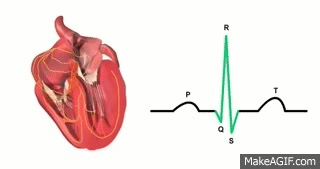
  </a>

  <h3 align="center">Identifying Heart Conditions using Machine Learning and Signal Processing</h3>

  <p align="center">
    Extract features from raw ECG signals using <a href="https://www.cinc.org/old/Proceedings/2002/pdf/101.pdf">Hamilton peak identification</a>, reduce dimensionality of data via principal component analysis (PCA), resample and fit a collection of multilabel models to the data including standalone models, ensembles, voting classifiers and meta learners. 
    <br />
    <a href="https://github.com/JLavigueure/Machine_Learning_ECG_Analysis"><strong>Explore the docs »</strong></a>
    <br />
  </p>
  
  <h4>Built With</h4>

[](https://docs.python.org/3/)
[](https://scikit-learn.org/stable/)
[](https://neuropsychology.github.io/NeuroKit/)
[](https://numpy.org/doc/)
[](https://pandas.pydata.org/docs/)
[](https://matplotlib.org/stable/contents.html)
[](https://neuropsychology.github.io/NeuroKit/)
</div>

<h3 align="center">Table Of Contents</h3>


1. [About the Project](#About-The-Project)
2. [Installation](#Getting-Started)
3. [Code Structure](#Code-Structure)
4. [Exploratory Data Analysis](Exploratory-Data-Analysis-(post-signal-processing))
5. [Data Cleaning and Resampling](Data-Cleaning-and-Resampling)
6. [Results](Results)
7. [Contact](Contact)


## About The Project

<div align="center">
    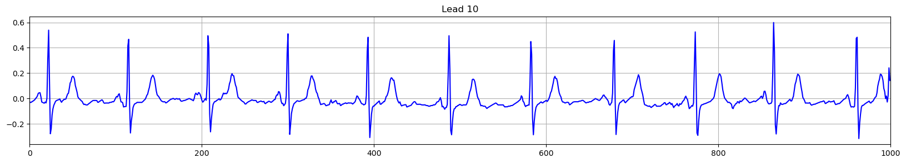
</div>

<p>

  <h3 align="center">Abstract</h3>
  <p align="center">The goal of this proejct is to create a model which can accurately identify 5 different types of heart conditions via ECG data using supervised learning models. The data was obtained from the <a href="https://physionet.org/content/ptb-xl/1.0.0/">PTB-XL ECG dataset</a> which contains common patient metadata (age, sex, height, weight) and a 10 second, 12 lead ECG with diagnoses labels for each patient. Using signal processing to extract features from the ECG's, a dataset of 136 rows is created. Common data cleaning (imputing, scaling) is applied, then the data is resampled using <a href="https://imbalanced-learn.org/stable/references/generated/imblearn.under_sampling.TomekLinks.html">Tomek links</a> + <a href="https://imbalanced-learn.org/stable/references/generated/imblearn.over_sampling.RandomOverSampler.html">random oversampling</a>. Features are reduced using feature-target correlation strengths, <a href="https://scikit-learn.org/stable/auto_examples/feature_selection/plot_select_from_model_diabetes.html">model-based feature selection</a>, and <a href="https://scikit-learn.org/stable/modules/generated/sklearn.decomposition.PCA.html">principal component analysis (PCA)</a>. 
  <br><br>The models tested were <a href="https://scikit-learn.org/stable/modules/generated/sklearn.linear_model.LogisticRegression.html" target="_blank">Logistic Regression</a>, 
<a href="https://scikit-learn.org/stable/modules/generated/sklearn.neighbors.KNeighborsClassifier.html" target="_blank">K-Nearest-Neighbor (KNN)</a>, 
<a href="https://scikit-learn.org/stable/modules/generated/sklearn.svm.SVC.html" target="_blank">Support Vector Classifier (SVC)</a>, 
<a href="https://scikit-learn.org/stable/modules/naive_bayes.html" target="_blank">Naive Bayes</a>, 
<a href="https://scikit-learn.org/stable/modules/generated/sklearn.ensemble.RandomForestClassifier.html" target="_blank">Random Forest</a>, 
<a href="https://scikit-learn.org/stable/modules/generated/sklearn.ensemble.BaggingClassifier.html" target="_blank">Bagging Classifier</a>, 
<a href="https://scikit-learn.org/stable/modules/generated/sklearn.ensemble.AdaBoostClassifier.html" target="_blank">AdaBoost</a>, and 
<a href="https://xgboost.readthedocs.io/en/release_3.0.0/" target="_blank">Gradient Boost</a>. The models were optimized for a balance of accuracy and recall (due to the medical nature). Of those models, SVC performed the best with ≈74% accuracy and recall. A subset of models were aggregated into both soft and hard voting classifiers, and the soft voting classifier had a higher accuracy of ≈76% but a lower recall of ≈71%. A series of stacked model were then tested fitting a variety of meta-learners on the other models' outputs, and although some achieved higher accuracy (≈79%), they had much worse recall (15-25%). 
  </p>

  <div align="center">
    <strong><a href="#results">Jump to Results ↴</a></strong>
  </div>

<br>
This repo contains a series of scripts which: 
</br>1. Load the <a href="https://physionet.org/content/ptb-xl/1.0.0/">PTB-XL ECG dataset</a>
</br>2. Extract features from raw ECG signals using signal processing techniques discovered by <a href="https://www.cinc.org/old/Proceedings/2002/pdf/101.pdf">P Hamilton</a> via the <a href="https://neuropsychology.github.io/NeuroKit/">NeuroKit2</a> Library
<br>3. Perform exploratory data analysis
<br>4. Clean and resample the data using Tomek links + random oversampling
<br>5. Perform <a href="https://scikit-learn.org/stable/modules/generated/sklearn.decomposition.PCA.html">PCA dimension reduction</a>
<br>6. Fit a variety of supervised learning models using a custom Multilabel Classifier class
<br>7. Fit hard and soft voting classifiers using models from the previous step
<br>8. Fit a stacked model using a meta-learner
</p>


<p align="right">(<a href="#readme-top">back to top</a>)</p>

<!-- GETTING STARTED -->
## Getting Started

### Prerequisites
* <a href="https://maven.apache.org/download.cgi">Python 3.12</a>
* <a href="https://pypi.org/project/pip/">Pip Package Installer</a>

### Installation
Linux
1. Clone the repo in your designated folder
   ```sh
   git clone https://github.com/JLavigueure/Machine_Learning_ECG_Analysis.git
   ```
2. Move into repo directory
   ```sh
   cd StockPredictor/
   ```
 3. Install dependencies
    ```sh
    pip install -r requirements.txt
    ```
3. Change shell script to executable
   ```sh
   chmod +x run.sh
   ```
4. Run pipeline
   ```sh
   ./run.sh
   ```
<p align="right">(<a href="#readme-top">back to top</a>)</p>

## Code Structure
All the scripts are saved in the main repo directory. Additional custcom classes for multilabel models, voting classifiers, and stack models are under the classes folder. The scripts are intended to run in order, and each saves its output via pickle files. Each script's description and usage is stated at the top of the file as a docstring.

### Scripts
* **load_data.py**
  <br> Loads in the PTB-XL dataset and ECG files.
* **signal_processing.py**
  <br> Perform signal processing on the ECG data to extract features.
* **exploratory_data_analysis.py**
  <br> Performs EDA on the dataset: identifies quantity of missing values, distribution of data + labels, and correllation of features to each label. Save outputs to output/.
* **clean_data.py**
  <br> Remove low-correllation features, impute missing values, scale data, perform model-based feature selection, reduce dimensionality via PCA, split train and test data. 
* **resample_data.py**
  <br> Duplicates the data for each label creating a binary target, resamples each to balance minority labels
* **fit_models.py**
  <br> Fit models to the training data. Use random search with cross-validation to tune hyperparameters. Use custom MutlilabelClassifier class.
* **fit_voting_classifier.py**
  <br> Aggregate the models from the previous script into both hard and soft voting classifiers. Use custom MultilabelVotingClassifier class.
* **fit_meta_learner.py**
  <br> Refit models using the same parameters as discovered in fit_models.py except use only 80% of the training data. Fit a meta learner on those models output using the remaining 20% of training data. Use random search with cross-validation to tune meta-learner hyperparameters.
* **evaluate_models.py**
  <br> Load all fit models from a given file and report their accuracy, precision, recall, F1 score, and AUC for each label. Save metrics to a CSV file in metrics/.

  <p align="right">(<a href="#readme-top">back to top</a>)</p>

## Exploratory Data Analysis (post signal processing)
### Data Shape
* 21,837 Rows
* 136 Features
### Labels

<div style="display: flex; align-items: flex-start; gap: 20px;">
  <div>
    <table>
      <thead>
        <tr><th>Label</th><th>Diagnoses</th></tr>
      </thead>
      <tbody>
        <tr><td>NORM</td><td>Normal</td></tr>
        <tr><td>MI</td><td><a href="https://my.clevelandclinic.org/health/diseases/16818-heart-attack-myocardial-infarction">Myocardial Infarction</a> (heart attack)</td></tr>
        <tr><td>STTC</td><td><a href="https://www.ncbi.nlm.nih.gov/books/NBK459364/">ST Segment Change</a></td></tr>
        <tr><td>CD</td><td><a href="https://www.nhlbi.nih.gov/health/conduction-disorders#:~:text=A%20conduction%20disorder%2C%20also%20known,your%20heart's%20rate%20and%20rhythm.">Conduction Disorder</a> (heart block)</td></tr>
        <tr><td>HYP</td><td><a href="https://www.mayoclinic.org/diseases-conditions/hypertrophic-cardiomyopathy/symptoms-causes/syc-20350198">Hypertrophy</a></td></tr>
      </tbody>
    </table>
  </div>
  <div>
    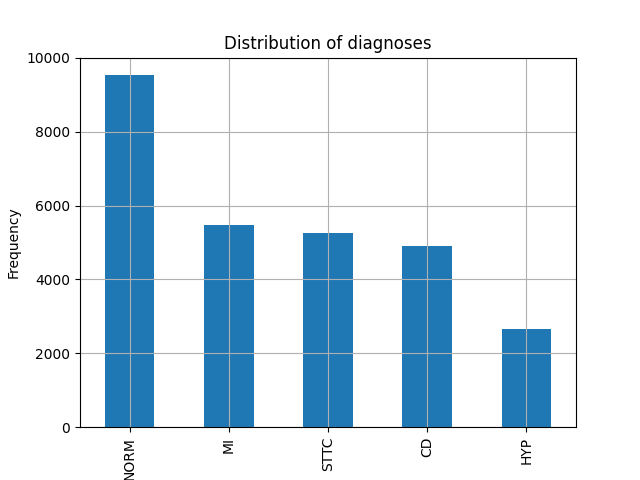
  </div>
</div>


### Distribution of Features
Distribution of metadata

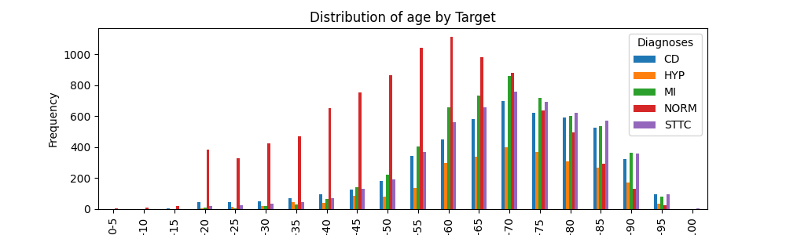
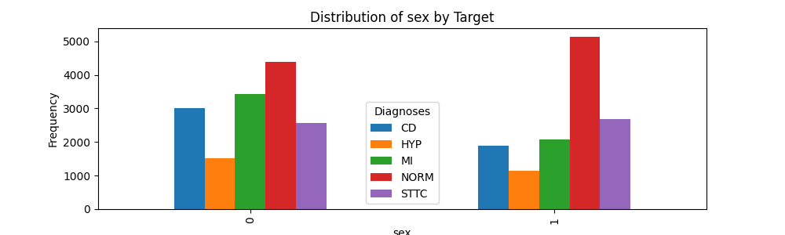
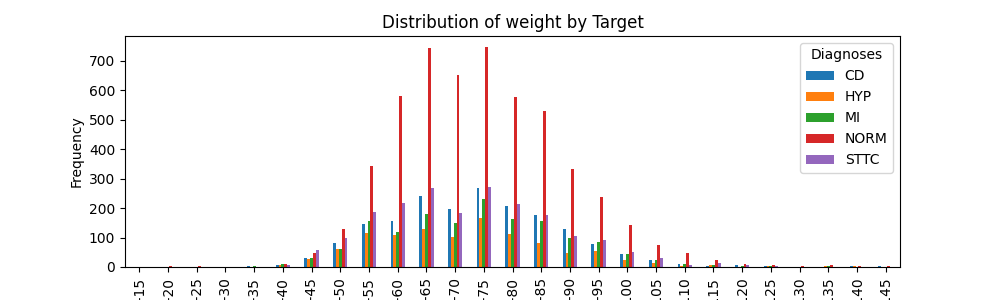
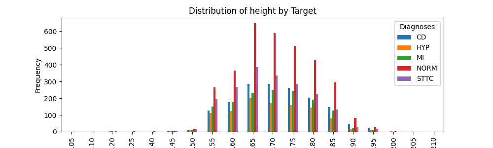

Distribution of 3 most correlated ECG features  

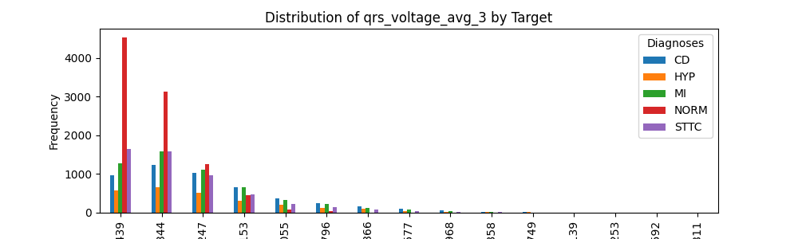
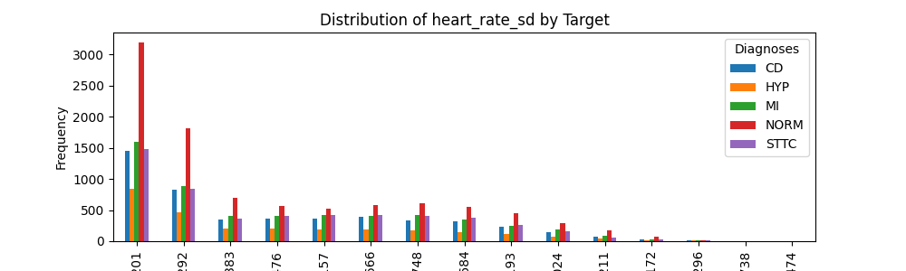
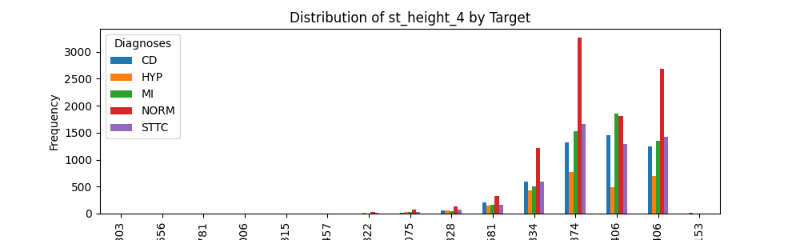


### Missing Values
List of features missing 1000+ rows.
| Feature              | Missing values |
|------------------|------|
| height           | 14,854 |
| weight           | 12,408 |
| qrs_sd_11        | 1425  |
| qrs_sd_10        | 1140  |
| qrs_sd_12        | 1009  |

List of missing values grouped by label and summed
| diagnostic_superclass | Total Missing Values   |
|------------------------|-----------|
| CD                     | 5336      |
| HYP                    | 5632      |
| MI                     | 6159      |
| NORM                   | 7756      |
| STTC                   | 9747      |

### Correlation
Top 5 most correlated features per label

| **Label** | **Feature**              | **Correlation** |
|----------|---------------------------|-----------------|
| **CD**   | Lead 3 QRS Voltage        | 0.1733          |
|          | Lead 6 QRS Voltage         | 0.1493          |
|          | Lead 5 ST Height          | -0.1483          |
|          | Lead 5 QRS Voltage        | 0.1404          |
|          | Lead 5 ST Height          | -0.1309          |
| **HYP**  | Lead 12 QRS Voltage        | 0.2317          |
|          | Lead 11 QRS Voltage        | 0.2285          |
|          | Lead 7 QRS Voltge         | 0.2197          |
|          | Lead 1 QRS Voltage         | 0.1837          |
|          | Lead 4 QRS Voltage        | 0.1834          |
| **MI**   | RT Duration               | -0.1532          |
|          | Age                       | 0.1493          |
|          | Lead 4 QRS Voltage        | -0.1404          |
| | Lead 4 QRS Voltage Standard Deviartion|-0.1025          |
|          | Lead 2 QRS Voltage         | -0.09674          |
| **NORM** | Age              | -0.4055          |
|          | RT Duration              | 0.3290          |
|          | Lead 3 QRS Voltage| -0.3076          |
|          | Lead 5 QRS Voltage| -0.2877          |
|          | T Duration Standard Deviation             | 0.2350          |
| **STTC** | Age                       | 0.1493          |
|          | RT Duration            | -0.1464          |
|          | T Duration         | -0.1433          |
|          | Heart Rate            | 0.1157          |
|       | T Duration Standard Deviation| -0.09399          |

Most correlated feature to each label

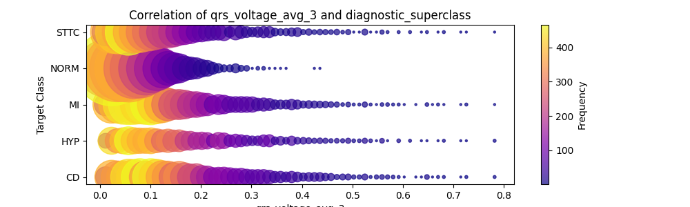
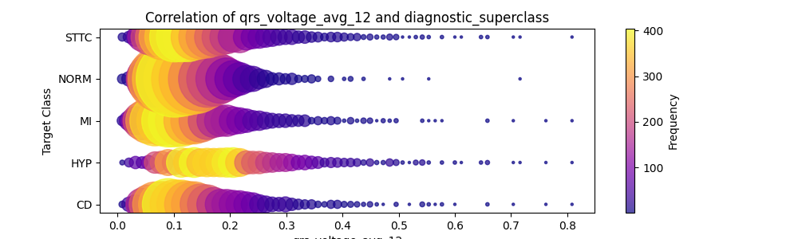
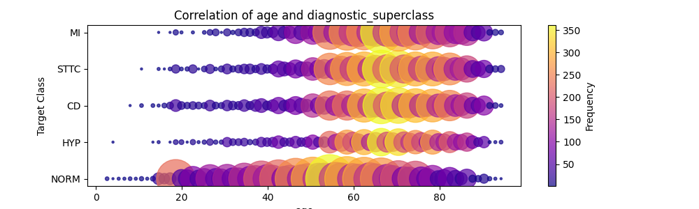

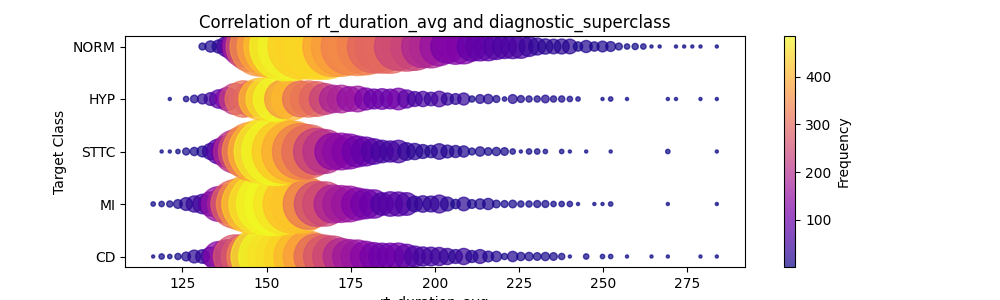


Correlation Matrix


<a href="images/CorrelationMatrix.png"> Click to zoom in</a>

<p align="right">(<a href="#readme-top">back to top</a>)</p>

## Data Cleaning and Resampling
1. Drop features with excessive missing values:

| Feature              | Missing values |
|------------------|------|
| height           | 14,854 |
| weight           | 12,408 |

2. Drop features with little correlation to target

| Feature | 
|------------|
|Lead 1-12, Total Voltage  |

3. Impute remaining missing values using the mean
4. Scale Data 
5. Model-based feature selection using RandomForest. Keeps features with feature-importance greater than the mean feature-importance. Reduces features from 136 to 72.
6. Apply PCA to reduce feature dimensionality from 72 to 39 features while preserving 95.11% of variance.
7. Split the data into train-test sets (75%-25%)
8. Duplicate the dataset 5 times (1 per label), then replace the diagnoses labels with a binary value, 1 if the corresponding label is present, else 0.
9. Resample each dataset, first applying TomekLinks then random oversampling to correct any remaining imbalance.

<p align="right">(<a href="#readme-top">back to top</a>)</p>

## Fitting models
The models tested were <a href="https://scikit-learn.org/stable/modules/generated/sklearn.linear_model.LogisticRegression.html" target="_blank">Logistic Regression</a>, 
<a href="https://scikit-learn.org/stable/modules/generated/sklearn.neighbors.KNeighborsClassifier.html" target="_blank">K-Nearest-Neighbor (KNN)</a>, 
<a href="https://scikit-learn.org/stable/modules/generated/sklearn.svm.SVC.html" target="_blank">Support Vector Classifier (SVC)</a>, 
<a href="https://scikit-learn.org/stable/modules/naive_bayes.html" target="_blank">Naive Bayes</a>, 
<a href="https://scikit-learn.org/stable/modules/generated/sklearn.ensemble.RandomForestClassifier.html" target="_blank">Random Forest</a>, 
<a href="https://scikit-learn.org/stable/modules/generated/sklearn.ensemble.BaggingClassifier.html" target="_blank">Bagging Classifier</a>, 
<a href="https://scikit-learn.org/stable/modules/generated/sklearn.ensemble.AdaBoostClassifier.html" target="_blank">AdaBoost</a>, and 
<a href="https://xgboost.readthedocs.io/en/release_3.0.0/" target="_blank">Gradient Boost</a>. Additionally, a subset of those models were aggregated into soft and hard <a href="https://www.geeksforgeeks.org/voting-classifier/">voting classifiers</a>. Finally each of those model types were used in a <a href="https://medium.com/@brijesh_soni/stacking-to-improve-model-performance-a-comprehensive-guide-on-ensemble-learning-in-python-9ed53c93ce28">stack model</a>, where they act as the blender for the original models. All models were trained on each label individually, and then aggregated into one MultilabelClassifier object to act as a single model outputting a 2D array of predictions. See custom classes used <a href="https://github.com/JLavigueure/Machine_Learning_ECG_Analysis/tree/main/classes">here</a>.
<br>

All models are fit using <a href="https://scikit-learn.org/stable/modules/generated/sklearn.model_selection.RandomizedSearchCV.html">random search</a> for hypertuning with <a href="https://scikit-learn.org/stable/modules/cross_validation.html">5-fold cross validation</a>. The parameter grids used for fitting models can be seen below.

```# Parameter grids for each model for random search
param_grids = {
    'LogisticRegression': {
        'C': [0.01, 1, 5, 10, 20, 50],  # Regularization strength
    },
    'KNN': {
        'n_neighbors': [300, 400, 500, 600, 700, 800],  # Number of neighbors
        'weights': ['uniform', 'distance'],  # Weighting strategy for neighbors
    },
    'GaussianNB': {
        # No hyperparameters to tune for GaussianNB
    },
    'SVC': {
        'C': [0.001, 0.01, 0.1],  # Regularization strength
        'kernel': ['rbf'],  # Type of kernel
        'gamma': [0.001, 0.01, 0.1, 1],  # Kernel coefficientW
        'class_weight': ['balanced'],  # Class weight
    },
    'RandomForest': {
        'n_estimators': [100, 200, 300, 400, 500],  # Number of trees in the forest
        'max_depth': [2, 5, 10, 15, 20],  # Max depth of the trees
        'min_samples_split': [100, 200, 300, 400, 500],  # Minimum samples required to split a node
        'max_features': [None, 0.2, 0.4, 0.6, 0.8],  # Number of features to consider when looking for the best split
        'bootstrap': [True, False]  # Whether bootstrap samples are used when building trees
    },
    'BaggingClassifier': {
            'estimator': [
                DecisionTreeClassifier(max_depth=5, min_samples_leaf=200),                                           
                DecisionTreeClassifier(max_depth=10, min_samples_leaf=200),                        
                DecisionTreeClassifier(max_depth=15, min_samples_leaf=200),                        
            ], # Base estimator
        'n_estimators': [200, 300, 400],  # Number of base estimators
        'max_samples': [0.5, 0.7, 1],  # Proportion of samples to draw for each base estimator
        'max_features': [0.1, 0.25, 0.5, 0.7],  # Proportion of features to draw for each base estimator
        'bootstrap': [True],  # Whether to sample with replacement
    },
    'AdaBoostClassifier': {
        'n_estimators': [50, 100, 200, 500, 700],  # Number of estimators (trees)
        'learning_rate': [0.01, 0.1, 0.2, 0.4, 0.6, 0.8, 1.0],  # Learning rate
    },
    'XGBClassifier': {
        'n_estimators': [1000],  # Number of boosting stages (trees)
        'learning_rate': [0.1],  # Learning rate
        'gamma': [5, 7, 10],  # Min loss reduction required to make a split
        'reg_alpha': [10, 15, 20, 25],  # L1 regularization
        'reg_lambda': [10, 15, 20, 25],  # L2 regularization
        'max_depth': [3, 5, 7, 9],  # Maximum depth of the trees
        'subsample': [0.2, 0.4, 0.6, 0.8, 1.0],  # Fraction of samples used for fitting each trees
        'n_jobs': [-1],  # Use all available cores
    }
}
```
The parameter grid for fitting meta-leaners can be seen below.
```    meta_param_grids = {
        'LogisticRegression': {
            'C': [0.001, 0.01, 0.1, 1, 10, 100],  # Regularization strength
        },
        'KNN': {
            'n_neighbors': [5, 10, 20, 50, 100],  # Number of neighbors
            'weights': ['uniform', 'distance'],  # Weighting strategy for neighbors
        },
        'GaussianNB': {
            # No hyperparameters to tune for GaussianNB
        },
        'SVC': {
            'C': [0.001, 0.01, 0.1, 1, 10],  # Regularization strength
            'kernel': ['rbf', 'linear', 'poly'],  # Kernel type
            'gamma': ['scale', 0.001, 0.01, 0.1, 1],  # Kernel coefficient
            'class_weight': ['balanced'],  # Class weight
        },
        'RandomForest': {
            'n_estimators': [50, 100, 200, 500],  # Number of trees in the forest
            'max_depth': [None, 5, 10, 20],  # Max depth of the trees
            'min_samples_split': [2, 5, 10],  # Minimum samples required to split a node
            'max_features': [0.2, 0.4, 0.6, 0.8, 1.0],  # Number of features to consider when looking for the best split
            'bootstrap': [True, False],  # Whether bootstrap samples are used when building trees
        },
        'BaggingClassifier': {
            'estimator': [
                DecisionTreeClassifier(max_depth=3),                                           
                DecisionTreeClassifier(max_depth=5),                        
                DecisionTreeClassifier(max_depth=10),                        
            ],  # Base estimator
            'n_estimators': [10, 50, 100],  # Number of base estimators
            'max_samples': [0.5, 0.7, 1.0],  # Proportion of samples to draw for each base estimator
            'max_features': [0.25, 0.5, 0.75, 1.0],  # Proportion of features to draw for each base estimator
            'bootstrap': [True, False],  # Whether to sample with replacement
        },
        'AdaBoostClassifier': {
            'n_estimators': [50, 100, 200],  # Number of estimators (trees)
            'learning_rate': [0.01, 0.1, 0.5, 1.0],  # Learning rate
        },
        'XGBClassifier': {
            'n_estimators': [100, 200, 500],  # Number of boosting stages (trees)
            'learning_rate': [0.01, 0.1, 0.3],  # Learning rate
            'gamma': [0, 1, 5],  # Min loss reduction required to make a split
            'reg_alpha': [0, 1, 10],  # L1 regularization
            'reg_lambda': [1, 5, 10],  # L2 regularization
            'max_depth': [3, 5, 7, 10],  # Maximum depth of the trees
            'subsample': [0.5, 0.7, 1.0],  # Fraction of samples used for fitting each trees
            'n_jobs': [-1],  # Use all available cores
        }
    }
```
<p align="right">(<a href="#readme-top">back to top</a>)</p>

## Results
All models were evaluated using a test set of the data that consisted of 5,459 rows.

<center><h3>Performance of models averaged across labels</h3></center>

#### === Models ===

| Model              | Accuracy | Precision | Recall | F1 Score | AUC    |  
| ------------------ | -------- | --------- | ------ | -------- | ------ |  
| XGBClassifier      | 76.51%   | 50.64%    | 69.17% | 58.08%   | 73.69% |  
| KNN                | 75.65%   | 50.83%    | 63.48% | 55.45%   | 69.58% |  
| RandomForest       | 74.40%   | 47.90%    | 67.69% | 55.44%   | 71.94% | 
| BaggingClassifier  | 74.29%   | 47.50%    | 68.84% | 55.53%   | 72.26% |  
| LogisticRegression | 73.87%   | 47.20%    | 73.63% | 56.83%   | 73.59% |  
| SVC                | 73.85%   | 47.28%    | 73.75% | 56.97%   | 73.46% |  
| AdaBoostClassifier | 73.48%   | 46.62%    | 71.52% | 55.80%   | 72.60% |  
| GaussianNB         | 70.47%   | 40.97%    | 54.88% | 46.54%   | 63.69% |  

#### === Voting Classifiers ===

| Model                | Accuracy | Precision | Recall | F1 Score | AUC    |
| -------------------- | -------- | --------- | ------ | -------- | ------ |
| SoftVotingClassifier | 76.03%   | 49.76%    | 71.39% | 58.28%   | 73.96% |
| HardVotingClassifier | 75.53%   | 49.16%    | 70.88% | 57.66%   | 73.41% |

#### === Meta-Leaners / Blenders ===

| Model                                          | Accuracy | Precision | Recall | F1 Score | AUC    |
| ---------------------------------------------- | -------- | --------- | ------ | -------- | ------ |
| XGBClassifier w/ probability   | 79.54%   | 51.80%    | 21.07% | 26.15%   | 58.54% |
| KNNProba w/ probability              | 79.38%   | 71.16%    | 18.56% | 21.68%   | 57.28% |
| RandomForest w/ probability       | 79.26%   | 34.03%    | 24.66% | 26.51%   | 59.34% |
| AdaBoostClassifier w/ probability   | 78.94%   | 39.91%    | 16.96% | 21.08%   | 56.95% |
| BaggingClassifier w/ probability   | 78.62%   | 37.14%    | 26.20% | 27.64%   | 59.41% |
| GaussianNB w/ probability         | 77.82%   | 61.98%    | 34.44% | 34.69%   | 61.58% |
| LogisticRegression w/ probability  | 75.42%   | 23.61%    | 14.37% | 17.05%   | 53.65% |
| KNN          | 75.13%   | 48.30%    | 67.23% | 55.77%   | 72.08% |
| GaussianNB      | 75.01%   | 48.46%    | 69.22% | 56.42%   | 72.86% |
| BaggingClassifier  | 74.79%   | 48.10%    | 69.71% | 56.29%   | 72.87% |
| RandomForest       | 74.78%   | 48.13%    | 69.36% | 56.16%   | 72.78% |
| XGBClassifier      | 74.75%   | 48.08%    | 69.77% | 56.29%   | 72.88% |
| LogisticRegression | 74.60%   | 47.90%    | 69.98% | 56.31%   | 72.79% |
| AdaBoostClassifier | 74.36%   | 47.66%    | 70.32% | 56.22%   | 72.76% |
| SVC                | 74.15%   | 47.55%    | 70.58% | 56.16%   | 72.75% |
| SVC w/ probability                | 71.33%   | 26.67%    | 7.02%  | 9.56%    | 49.78% |

<center><h3>Performance of models per label</h3></center>

#### === Models ===
| Model              | Label | Accuracy | Precision | Recall | F1 Score | AUC    |
| ------------------ | ----- | -------- | --------- | ------ | -------- | ------ |
| AdaBoostClassifier | CD    | 72.93%   | 43.01%    | 68.10% | 52.72%   | 71.20% |
|    | HYP   | 79.62%   | 34.02%    | 73.03% | 46.41%   | 76.78% |
|    | MI    | 69.45%   | 43.38%    | 70.43% | 53.69%   | 69.78% |
|   | NORM  | 75.48%   | 69.82%    | 77.28% | 73.36%   | 75.68% |
|   | STTC  | 69.95%   | 42.86%    | 68.76% | 52.80%   | 69.55% |
| BaggingClassifier  | CD    | 75.27%   | 45.88%    | 64.38% | 53.58%   | 71.38% |
|    | HYP   | 78.96%   | 32.94%    | 71.52% | 45.10%   | 75.75% |
|    | MI    | 70.42%   | 44.17%    | 66.72% | 53.15%   | 69.19% |
|    | NORM  | 75.75%   | 70.68%    | 76.07% | 73.27%   | 75.79% |
|    | STTC  | 71.04%   | 43.84%    | 65.54% | 52.54%   | 69.18% |
| GaussianNB         | CD    | 72.45%   | 39.21%    | 44.13% | 41.52%   | 62.32% |
|           | HYP   | 79.40%   | 30.25%    | 53.94% | 38.76%   | 68.42% |
|           | MI    | 70.00%   | 41.73%    | 48.73% | 44.96%   | 62.94% |
|           | NORM  | 60.00%   | 52.75%    | 81.10% | 63.92%   | 62.36% |
|           | STTC  | 70.49%   | 40.91%    | 46.52% | 43.53%   | 62.39% |
| KNN                | CD    | 81.43%   | 60.43%    | 46.94% | 52.84%   | 69.09% |
|                  | HYP   | 87.34%   | 47.78%    | 50.45% | 49.08%   | 71.44% |
|                  | MI    | 70.92%   | 44.33%    | 61.18% | 51.41%   | 67.68% |
|                  | NORM  | 68.00%   | 58.37%    | 93.38% | 71.84%   | 70.84% |
|                  | STTC  | 70.55%   | 43.25%    | 65.47% | 52.09%   | 68.83% |
| LogisticRegression | CD    | 73.63%   | 43.92%    | 68.68% | 53.58%   | 71.86% |
|   | HYP   | 79.74%   | 34.64%    | 76.21% | 47.63%   | 78.22% |
|   | MI    | 69.52%   | 43.65%    | 72.91% | 54.61%   | 70.65% |
|   | NORM  | 76.52%   | 70.72%    | 78.96% | 74.61%   | 76.79% |
|   | STTC  | 69.93%   | 43.06%    | 71.39% | 53.72%   | 70.42% |
| RandomForest       | CD    | 75.46%   | 46.07%    | 62.98% | 53.21%   | 70.99% |
|         | HYP   | 81.08%   | 35.12%    | 66.67% | 46.00%   | 74.86% |
|         | MI    | 69.32%   | 43.18%    | 69.63% | 53.30%   | 69.42% |
|         | NORM  | 75.97%   | 72.25%    | 73.09% | 72.67%   | 75.65% |
|         | STTC  | 70.18%   | 42.88%    | 66.07% | 52.00%   | 68.79% |
| SVC                | CD    | 75.81%   | 46.67%    | 64.21% | 54.05%   | 71.66% |
|                  | HYP   | 80.70%   | 35.70%    | 74.55% | 48.28%   | 78.04% |
|                  | MI    | 67.99%   | 42.28%    | 74.80% | 54.02%   | 70.25% |
|                  | NORM  | 76.03%   | 69.60%    | 80.13% | 74.50%   | 76.49% |
|                  | STTC  | 68.72%   | 42.15%    | 75.06% | 53.99%   | 70.86% |
| XGBClassifier      | CD    | 77.23%   | 48.97%    | 64.79% | 55.78%   | 72.78% |
|        | HYP   | 83.85%   | 40.04%    | 67.58% | 50.28%   | 76.83% |
|        | MI    | 71.72%   | 45.92%    | 70.07% | 55.48%   | 71.17% |
|        | NORM  | 77.22%   | 72.57%    | 76.95% | 74.69%   | 77.19% |
|        | STTC  | 72.51%   | 45.72%    | 66.44% | 54.17%   | 70.46% |

#### === Voting Classifiers ===
| Model                | Label | Accuracy | Precision | Recall | F1 Score | AUC    |
| -------------------- | ----- | -------- | --------- | ------ | -------- | ------ |
| HardVotingClassifier | CD    | 77.55%   | 49.47%    | 62.23% | 55.12%   | 72.07% |
|  | HYP   | 83.11%   | 38.80%    | 68.79% | 49.62%   | 76.94% |
|  | MI    | 69.82%   | 43.83%    | 71.16% | 54.25%   | 70.26% |
|  | NORM  | 76.45%   | 69.77%    | 81.35% | 75.12%   | 77.00% |
|  | STTC  | 70.73%   | 43.90%    | 70.86% | 54.21%   | 70.78% |
| SoftVotingClassifier | CD    | 77.25%   | 48.98%    | 63.80% | 55.42%   | 72.44% |
|  | HYP   | 83.22%   | 39.13%    | 69.85% | 50.16%   | 77.46% |
|  | MI    | 70.95%   | 45.10%    | 71.38% | 55.27%   | 71.09% |
|  | NORM  | 76.85%   | 70.40%    | 81.14% | 75.39%   | 77.33% |
|  | STTC  | 71.85%   | 45.17%    | 70.79% | 55.15%   | 71.49% |


#### === Meta-Leaners / Blenders ===

| Model                                          | Label | Accuracy | Precision | Recall | F1 Score | AUC    |
| ---------------------------------------------- | ----- | -------- | --------- | ------ | -------- | ------ |
| AdaBoostClassifier | CD    | 72.64%   | 42.57%    | 67.19% | 52.12%   | 70.69% |
|  | HYP   | 81.06%   | 35.55%    | 69.70% | 47.08%   | 76.16% |
|  | MI    | 69.65%   | 43.51%    | 69.34% | 53.47%   | 69.55% |
|  | NORM  | 77.00%   | 72.17%    | 77.07% | 74.54%   | 77.01% |
|  | STTC  | 71.43%   | 44.51%    | 68.31% | 53.90%   | 70.38% |
| AdaBoostClassifier w/ probability   | CD    | 81.14%   | 70.55%    | 25.54% | 37.50%   | 61.25% |
|    | HYP   | 87.91%   | 0.00%     | 0.00%  | 0.00%    | 50.00% |
|    | MI    | 74.85%   | 50.00%    | 0.15%  | 0.29%    | 50.05% |
|    | NORM  | 75.26%   | 78.99%    | 59.09% | 67.61%   | 73.45% |
|    | STTC  | 75.55%   | 0.00%     | 0.00%  | 0.00%    | 50.00% |
| BaggingClassifier  | CD    | 72.64%   | 42.57%    | 67.19% | 52.12%   | 70.69% |
|   | HYP   | 80.26%   | 34.56%    | 70.91% | 46.47%   | 76.23% |
|   | MI    | 71.78%   | 45.80%    | 66.72% | 54.31%   | 70.10% |
|   | NORM  | 77.05%   | 72.21%    | 77.20% | 74.62%   | 77.07% |
|   | STTC  | 72.22%   | 45.35%    | 66.52% | 53.93%   | 70.29% |
| BaggingClassifier w/ probability    | CD    | 76.12%   | 46.22%    | 47.52% | 46.86%   | 65.89% |
|     | HYP   | 87.91%   | 0.00%     | 0.00%  | 0.00%    | 50.00% |
|     | MI    | 75.99%   | 64.76%    | 9.91%  | 17.18%   | 54.05% |
|     | NORM  | 77.56%   | 74.69%    | 73.60% | 74.14%   | 77.12% |
|     | STTC  | 75.51%   | 0.00%     | 0.00%  | 0.00%    | 49.98% |
| GaussianNB         | CD    | 73.99%   | 44.20%    | 66.12% | 52.98%   | 71.18% |
|         | HYP   | 81.03%   | 35.58%    | 70.30% | 47.25%   | 76.40% |
|         | MI    | 71.26%   | 45.20%    | 67.15% | 54.03%   | 69.90% |
|         | NORM  | 76.67%   | 72.08%    | 76.07% | 74.02%   | 76.60% |
|         | STTC  | 72.12%   | 45.23%    | 66.44% | 53.82%   | 70.20% |
| GaussianNB w/ probability           | CD    | 77.91%   | 50.14%    | 57.27% | 53.47%   | 70.53% |
|            | HYP   | 87.93%   | 100.00%   | 0.15%  | 0.30%    | 50.08% |
|            | MI    | 72.93%   | 45.50%    | 38.67% | 41.81%   | 61.56% |
|            | NORM  | 75.04%   | 70.84%    | 72.88% | 71.84%   | 74.80% |
|            | STTC  | 75.31%   | 43.43%    | 3.22%  | 6.00%    | 50.93% |
| KNN                | CD    | 73.96%   | 44.12%    | 65.70% | 52.79%   | 71.00% |
|                 | HYP   | 81.10%   | 34.05%    | 60.15% | 43.48%   | 72.07% |
|                 | MI    | 71.30%   | 45.27%    | 67.66% | 54.25%   | 70.09% |
|                 | NORM  | 77.09%   | 72.69%    | 76.19% | 74.40%   | 76.99% |
|                 | STTC  | 72.22%   | 45.35%    | 66.44% | 53.90%   | 70.26% |
| KNN w/ probability                  | CD    | 80.79%   | 85.15%    | 16.12% | 27.10%   | 57.66% |
|                  | HYP   | 88.33%   | 96.00%    | 3.64%  | 7.01%    | 51.81% |
|                  | MI    | 74.93%   | 100.00%   | 0.29%  | 0.58%    | 50.15% |
|                  | NORM  | 77.31%   | 74.67%    | 72.76% | 73.70%   | 76.80% |
|                  | STTC  | 75.55%   | 0.00%     | 0.00%  | 0.00%    | 50.00% |
| LogisticRegression | CD    | 72.64%   | 42.57%    | 67.19% | 52.12%   | 70.69% |
|  | HYP   | 81.06%   | 35.55%    | 69.70% | 47.08%   | 76.16% |
|  | MI    | 70.95%   | 44.91%    | 68.39% | 54.21%   | 70.10% |
|  | NORM  | 76.56%   | 71.53%    | 76.99% | 74.16%   | 76.61% |
|  | STTC  | 71.81%   | 44.93%    | 67.64% | 53.99%   | 70.40% |
| LogisticRegression w/ probability   | CD    | 74.43%   | 23.28%    | 6.69%  | 10.40%   | 50.21% |
|    | HYP   | 86.37%   | 4.35%     | 0.61%  | 1.06%    | 49.39% |
|    | MI    | 69.34%   | 6.12%     | 1.53%  | 2.45%    | 46.83% |
|    | NORM  | 76.25%   | 79.20%    | 61.90% | 69.49%   | 74.64% |
|    | STTC  | 70.71%   | 5.10%     | 1.12%  | 1.84%    | 47.18% |
| RandomForest       | CD    | 72.66%   | 42.60%    | 67.27% | 52.16%   | 70.73% |
|        | HYP   | 80.24%   | 34.54%    | 70.91% | 46.45%   | 76.21% |
|        | MI    | 71.04%   | 44.96%    | 67.59% | 54.00%   | 69.90% |
|        | NORM  | 77.33%   | 72.81%    | 76.78% | 74.75%   | 77.27% |
|        | STTC  | 72.62%   | 45.74%    | 64.27% | 53.44%   | 69.80% |
| RandomForest w/ probability         | CD    | 81.14%   | 59.26%    | 47.60% | 52.80%   | 69.14% |
|          | HYP   | 87.91%   | 0.00%     | 0.00%  | 0.00%    | 50.00% |
|          | MI    | 74.19%   | 35.71%    | 3.28%  | 6.00%    | 50.65% |
|          | NORM  | 77.49%   | 75.16%    | 72.42% | 73.77%   | 76.92% |
|          | STTC  | 75.55%   | 0.00%     | 0.00%  | 0.00%    | 50.00% |
| SVC                | CD    | 72.64%   | 42.57%    | 67.19% | 52.12%   | 70.69% |
|                 | HYP   | 81.06%   | 35.55%    | 69.70% | 47.08%   | 76.16% |
|                 | MI    | 69.65%   | 43.53%    | 69.63% | 53.57%   | 69.64% |
|                 | NORM  | 77.23%   | 72.85%    | 76.36% | 74.57%   | 77.14% |
|                 | STTC  | 70.18%   | 43.23%    | 70.04% | 53.46%   | 70.13% |
| SVC w/ probability                  | CD    | 77.86%   | 52.94%    | 0.74%  | 1.47%    | 50.28% |
|                   | HYP   | 67.42%   | 2.38%     | 4.24%  | 3.05%    | 40.17% |
|                   | MI    | 71.17%   | 4.11%     | 0.66%  | 1.13%    | 47.76% |
|                   | NORM  | 64.63%   | 73.92%    | 29.46% | 42.13%   | 60.70% |
|                   | STTC  | 75.55%   | 0.00%     | 0.00%  | 0.00%    | 50.00% |
| XGBClassifier      | CD    | 73.02%   | 43.02%    | 66.94% | 52.38%   | 70.85% |
|       | HYP   | 80.26%   | 34.56%    | 70.91% | 46.47%   | 76.23% |
|       | MI    | 71.25%   | 45.18%    | 67.23% | 54.04%   | 69.91% |
|       | NORM  | 77.14%   | 72.45%    | 76.95% | 74.63%   | 77.12% |
|       | STTC  | 72.07%   | 45.19%    | 66.82% | 53.91%   | 70.29% |
| XGBClassifier w/ probability        | CD    | 81.34%   | 68.54%    | 29.17% | 40.93%   | 62.68% |
|         | HYP   | 87.91%   | 0.00%     | 0.00%  | 0.00%    | 50.00% |
|         | MI    | 75.90%   | 62.03%    | 10.71% | 18.26%   | 54.25% |
|         | NORM  | 77.00%   | 78.42%    | 65.34% | 71.28%   | 75.69% |
|         | STTC  | 75.55%   | 50.00%    | 0.15%  | 0.30%    | 50.05% |


<p align="right">(<a href="#readme-top">back to top</a>)</p>


<!-- CONTACT -->
## Contact
<table>
  <tr>
    <td>
      <p><strong style="font-size: 2.5em;">Jordan Lavigueure</strong><br>
      <strong style="font-size: 1em;">University of Washington, B.S. Computer Science 2025</strong></p>
      ✉️ lav.jordan@live.com <br><br>
      <a href="https://www.linkedin.com/in/jordanlavigueure">
        
      </a>
      <a href="https://github.com/JLavigueure">
        
      </a>
    </td>
    <td>
      
    </td>
  </tr>
</table>


<p align="right">(<a href="#readme-top">back to top</a>)</p>
